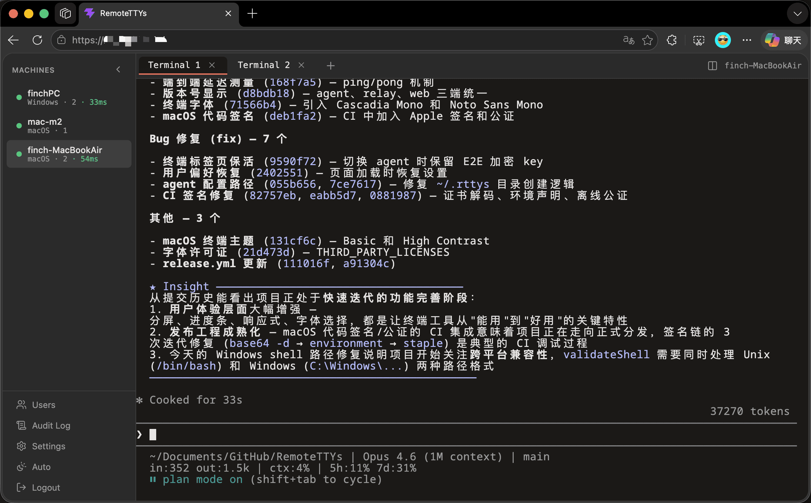
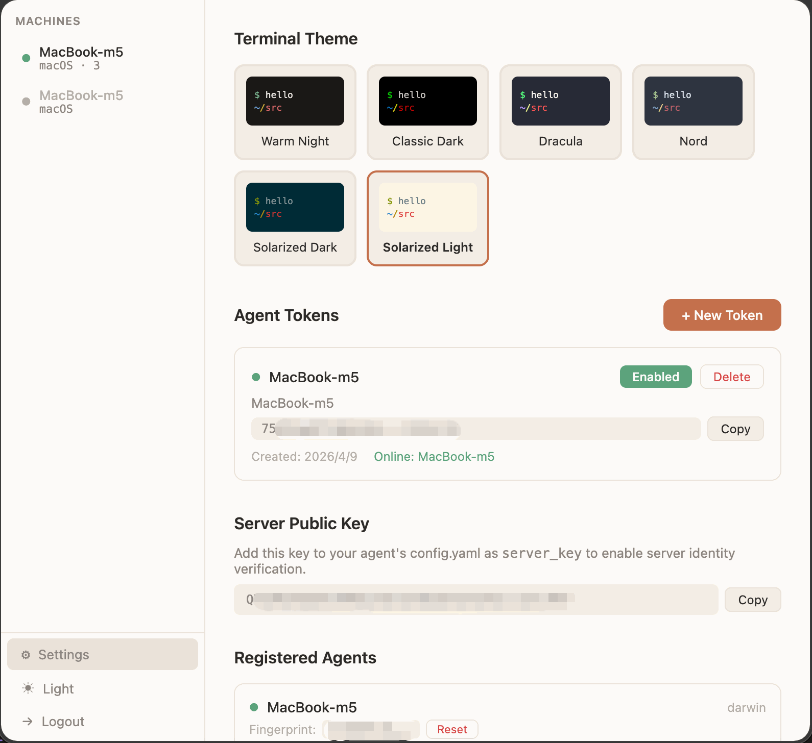

<p align="center">
  
</p>

<h1 align="center">RemoteTTYs</h1>

[](LICENSE)
[](agent/go.mod)
[](packages/relay/package.json)
[](packages/web/package.json)
[](Dockerfile)
[]()

Remotely access the terminal on your home PC/Mac from a browser, no NAT traversal needed. Run Claude Code, Codex, vim, or any CLI tool and command directly.

> ⚠️ **Warning**: This project is for personal use and experimentation only — do NOT deploy it in production environments. You are solely responsible for securing your own data and connections. When exposing the relay to the public internet, always use a reverse proxy with HTTPS (e.g. [Caddy](https://caddyserver.com/)) to encrypt all traffic.

**[中文 README](README.zh-CN.md)** | [](https://deepwiki.com/finch-xu/RemoteTTYs) | **[English Docs](https://finch-xu.github.io/docs/remotettys/)** | **[中文文档](https://finch-xu.github.io/docs/zh/remotettys/)**


## Screenshots

<p>
  
</p>
<p>
  
</p>

## How It Works

```
Local Machine(s)              Remote Server                Browser(s)
┌──────────────┐             ┌──────────────┐            ┌──────────┐
│  rttys-agent │──outbound──▶│  rttys-relay │◀───HTTPS───│ Web UI   │
│  (Go binary, │   WSS       │  (Node.js)   │   + WSS    │ ghostty  │
│   no open    │◀────────────│              │───────────▶│  -web    │
│   ports)     │             └──────────────┘            └──────────┘
└──────────────┘
```

- **Agent** runs on your local machines and connects outbound to the relay — no open ports, no NAT traversal needed
- **Relay** routes messages between agents and browsers without ever reading terminal content
- **Web UI** renders terminals using [ghostty-web](https://github.com/coder/ghostty-web) (Ghostty's VT100 parser compiled to WebAssembly)

## Features

- No NAT traversal, no remote desktop, no remote AI tool — just remote your terminal
- macOS, Linux, Windows full platform support
- Multiple machines in one dashboard with online/offline status
- Scrollback replay on browser reconnect (1MB buffer per session)
- Multi-user authentication with JWT (httpOnly cookie + CSRF protection)
- End-to-end encryption (ECDH P-256 + AES-256-GCM) — relay cannot read terminal content
- Ed25519 challenge-response for server identity verification
- Agent identity keys with TOFU (SSH-like trust model) for MITM protection
- Machine fingerprint binding to prevent token reuse across machines
- Audit logging (login, connections, session lifecycle)
- Single Go binary agent — zero dependencies on target machines
- Daemon mode with auto-reconnect (exponential backoff)

## Deploy the Server

The server (relay + web UI) runs as a single Docker container.

```bash
git clone https://github.com/finch-xu/RemoteTTYs.git
cd RemoteTTYs
docker compose up -d
```

The server starts on port 8080. On first visit, you'll be guided through a setup page to create your admin account.

> Use a reverse proxy (Caddy, nginx) for HTTPS termination in production. Agents connect via `wss://`.

### LAN Deployment (no SSL)

If you're running on a local network without HTTPS, create a `.env` file:

```bash
cp .env.example .env
```

Edit `.env`:

```
NODE_ENV=development
JWT_SECRET=your-random-secret-here
```

The Docker image sets `NODE_ENV=production` by default, which enables the `Secure` flag on cookies — browsers will refuse to send cookies over plain HTTP. Setting `NODE_ENV=development` disables this flag so authentication works over `http://`.

> **Note:** `JWT_SECRET` must be set explicitly for LAN deployments — in development mode without it, a random secret is generated on each restart, which means all users get logged out whenever the container restarts.

The agent should connect with `ws://` instead of `wss://`:

```yaml
relay: ws://192.168.1.100:8080/ws/agent
```

## Install the Agent

The agent is a single Go binary that runs on your local machines.

### 1. Download

Go to the [Releases](https://github.com/finch-xu/RemoteTTYs/releases) page and download the binary for your platform:

| Platform | File |
|----------|------|
| **macOS menu bar app (recommended)** ⭐ | `RttysAgent.zip` |
| macOS CLI (Apple Silicon) | `rttys-agent-macOS-arm64` |
| macOS CLI (Intel) | `rttys-agent-macOS-x64` |
| Linux (x86_64) | `rttys-agent-Linux-x64` |
| Linux (ARM64) | `rttys-agent-Linux-arm64` |
| Windows (x86_64) | `rttys-agent-Windows-x64.exe` |

**macOS menu bar app:** unzip and drag `RttysAgent.app` to `/Applications`. Launching it adds a menu bar icon with live connection status, log viewer, and a built-in config editor — no terminal commands needed. Universal binary (arm64 + x86_64), Developer ID signed, notarized, and self-updates via [Sparkle](https://sparkle-project.org/). If you install the app, skip sections 2–3 below and configure via the menu bar UI instead.

> **First-run permission prompts:** The first time a terminal session reaches into a protected folder (e.g. `~/Documents`, `~/Desktop`, `~/Downloads`, or iCloud Drive), macOS will show a system dialog like *"RttysAgent would like to access files in your Documents folder"*. Click **Allow** — this is macOS's standard TCC privacy mechanism, not an issue with the app, and each folder only asks once. To grant access to everything up front, add RttysAgent under **System Settings → Privacy & Security → Full Disk Access**.

**macOS / Linux CLI:**

```bash
chmod +x rttys-agent-*
mv rttys-agent-* rttys-agent
```

**Windows:** No extra steps — run the `.exe` directly.

### 2. Configure

```bash
./rttys-agent init
```

This creates `config.yaml` in the same directory as the binary:

```yaml
relay: wss://your-server.com/ws/agent
token: your-agent-token
server_key: <base64-encoded-server-public-key>
name: my-machine
shell: /bin/zsh
```

- **token**: Create an agent token in the web UI (Settings page) and paste it here.
- **server_key**: Copy the server's Ed25519 public key from the Settings page and paste it here. The agent uses this to verify server identity before sending any data.

### 3. Run

```bash
./rttys-agent              # foreground
./rttys-agent -d           # daemon mode (logs to ~/.rttys/agent.log)
./rttys-agent status       # check if running
./rttys-agent stop         # stop daemon
```

The agent reconnects automatically with exponential backoff (1s to 30s cap).

## Security Model

### Transport Security

The agent-to-server connection is protected by three layers:

1. **Token authentication at HTTP layer** — the agent sends its token in the `X-Token` HTTP header during WebSocket upgrade. Invalid tokens are rejected before the WebSocket connection is established.
2. **Ed25519 challenge-response** — after the WebSocket is established, the server signs the agent's token with its Ed25519 private key and sends it as a challenge. The agent verifies the signature using the pre-configured server public key. Data is only sent after verification passes.
3. **Machine fingerprint binding** — the agent reports a SHA-256 hash of the machine's unique ID. The server records it on first connection and rejects mismatches on subsequent connections, preventing token reuse on different machines.

### End-to-End Encryption

All terminal content (keystrokes and output) is end-to-end encrypted between the browser and the agent. The relay server cannot read or modify terminal data — it only forwards encrypted payloads.

- **Key exchange**: ECDH P-256 ephemeral key pair per session, providing forward secrecy
- **Symmetric encryption**: AES-256-GCM with counter-based nonces for replay protection
- **Key derivation**: HKDF-SHA256 with directional keys (browser→agent and agent→browser use separate keys)
- **MITM protection**: Each agent has an Ed25519 identity key. The browser stores it on first connection (Trust On First Use, like SSH). If the key changes, a warning dialog is shown.
- **Control message integrity**: `pty.resize` and `pty.close` messages are authenticated with HMAC-SHA256

Verify an agent's fingerprint by running `rttys-agent status` on the agent machine and comparing with what the browser shows.

## Management API

All endpoints require authentication (session cookie). State-changing endpoints also require the `X-CSRF-Token` header.

```bash
# Setup (first-time only)
GET    /api/setup/status
POST   /api/setup/init                    # {"username":"x","password":"y"}

# Auth
POST   /api/auth/login                    # {"username":"x","password":"y"}
GET    /api/auth/me
POST   /api/auth/logout

# Users
GET    /api/users
POST   /api/users                         # {"username":"x","password":"y"}
DELETE /api/users/:username
PUT    /api/users/:username/password      # {"password":"new"}

# User Preferences
PUT    /api/preferences                   # {"uiTheme":"dark","terminalTheme":"ghostty"}

# Agent Tokens
GET    /api/tokens
POST   /api/tokens                        # {"label":"Home Mac","notes":"..."}
PUT    /api/tokens/:id/enabled            # {"enabled":false}
DELETE /api/tokens/:token

# Agents
GET    /api/agents
DELETE /api/agents/:id
DELETE /api/agents/:id/fingerprint        # Reset machine fingerprint

# Server Key
GET    /api/server-key                    # Get Ed25519 public key

# Audit Log
GET    /api/audit?limit=100
```

## Development

### Prerequisites

- Node.js 24+
- Go 1.22+

### Setup

```bash
npm install
cd agent && go mod download
```

### Run locally (3 terminals)

```bash
# Terminal 1: Relay
cd packages/relay && npm run dev

# Terminal 2: Web UI (Vite dev server, proxies to relay)
cd packages/web && npm run dev

# Terminal 3: Agent
cd agent && go run . -relay ws://localhost:8080/ws/agent
```

Open `http://localhost:5173` and create your admin account on the setup page.

### Build

```bash
make all        # build agent + relay + web
make agent      # Go binary → bin/rttys-agent
make relay      # TypeScript → packages/relay/dist/
make web        # Vite build → packages/relay/public/
```

Cross-compile the agent:

```bash
cd agent
GOOS=linux  GOARCH=amd64 go build -o rttys-agent-linux-amd64 .
GOOS=darwin GOARCH=arm64 go build -o rttys-agent-darwin-arm64 .
```

### Type check

```bash
cd packages/relay && npx tsc --noEmit
cd packages/web && npx tsc --noEmit
cd agent && go vet ./...
```

## Project Structure

```
remotettys/
├── agent/              # Go — local agent binary (cross-platform CLI)
├── agent-mac/          # Swift — macOS menu bar app wrapping the Go agent
├── packages/
│   ├── relay/          # TypeScript — WebSocket relay + REST API
│   └── web/            # React + Vite — browser terminal UI
├── Dockerfile          # Multi-stage build for server
├── docker-compose.yml  # Production deployment
├── Makefile            # Build all components
└── package.json        # npm workspaces
```

## License

[MIT](LICENSE)
